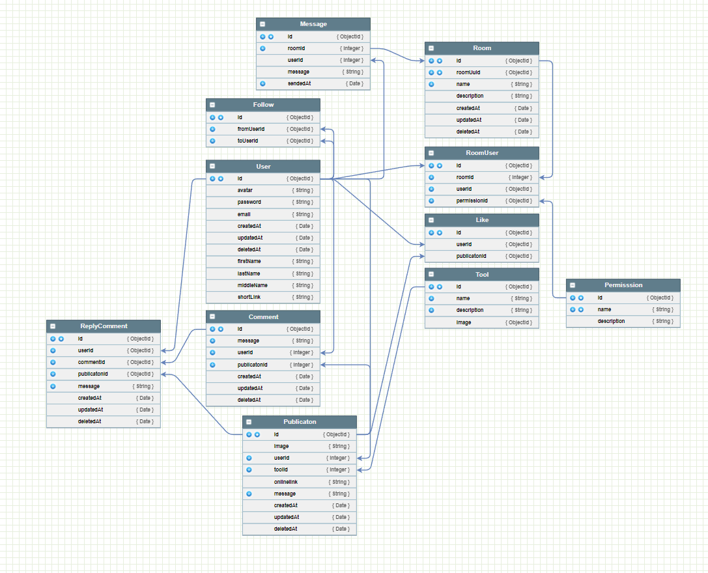
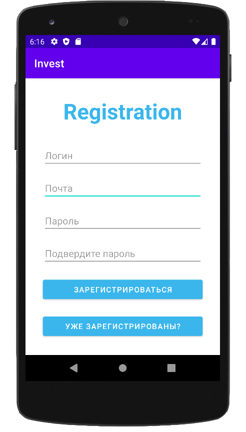
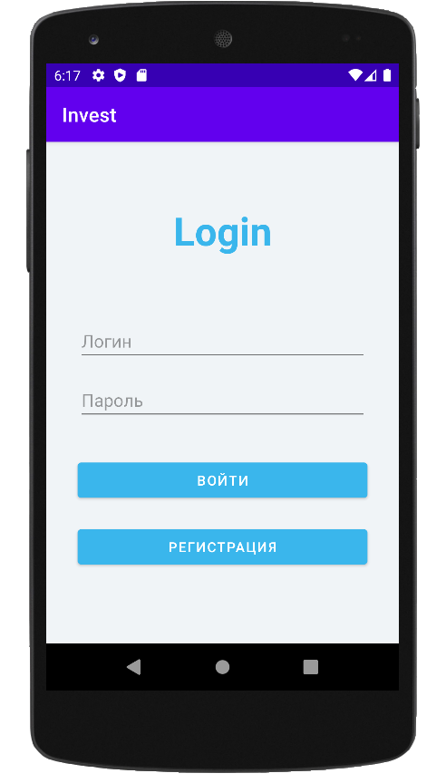

# Social Network

Наш проек - это социальная сеть для инвесторов, с помощью которой они смогут общаться и 
контактировать между собой.

# Структура проекта

> Основные пункты нашего проекта и их описание

---

### Дополнительная документация

- [ERD-схема](./API/docs/database.png)

### Установки

```
git clone https://github.com/MihailUse/hackchange.git
```
>Установка проекта

```
npm install
```
>Установка модулей

```
npm run initdb
```
>Инициализация базы данных

### Настройки

Переимменуйте файл template.env в .env и измените параметры
```
NODE_ENV=development
PORT=3000

NODE_HOST=localhost
NODE_PORT=3000
NODE_PROTOCOL=http

SALT_ROUNDS=64270cbfa2a4
TOKEN_SECRET=c20102256aaacf13c87db76f7b4c901b026d778cc0802ff23064f7959a603c8b

DB_NAME=
DB_USER=
DB_PASS=
DB_DRIVER=postgres
DB_HOST=
DB_PORT=5432
```

### Запуск

```
npm run dev
```
>Запуск проекта

### База данных

Наша ERD-схема базы данных. Состоит из 11-ти таблиц:


>Воссоздана в нормальной форме

### Регистрация и аутентификация

У нас в API используется JSON Web Token


Визуальное представление решения





### Дизайн

### Лайки и комментарии

### Профиль

### Лента инструментов

### Система ранга профиля

### Справочник

### Система уведомлений

### Чат
